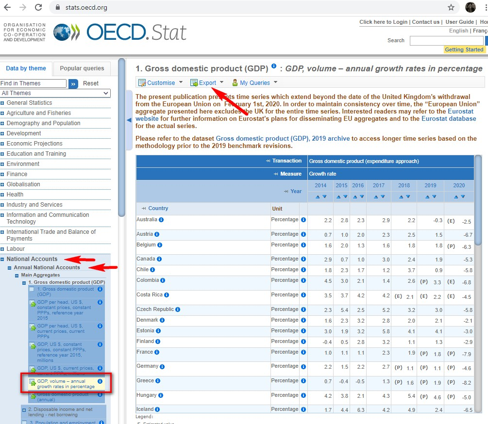

## Informe 2
## *Medidas de contención COVID-19 vs. crecimiento económico*

En el actual contexto de la pandemia de coronavirus, se ha discutido sobre la idoneidad de imponer medidas de restricción de la actividad por el daño que hace a la economía. Así, hay quienes argumentan que existe un “trade-off” entre contención de la pandemia y economía: un excesivo énfasis en controlar la pandemia podría llevar a una excesiva reducción de la actividad económica y, por tanto, a una grave crisis económica. A este respecto, resulta interesante analizar si los países que han conseguido contener más la pandemia han sufrido una mayor caída del PIB.

Para responder a esta cuestión, vamos a usar datos de COVID-19 de Our World in Data y datos de PIB de la OCDE.

Debéis centraros en los países de la OCDE, es decir, los que están en la tabla de datos del PIB. Por tanto, vuestra muestra debe contener 38 países.

Por una parte, debéis calcular la tasa de muertes acumuladas por COVID-19 (por millón de habitantes) desde enero a diciembre de 2020. Por otra, con relación al PIB, debéis calcular la tasa de variación anual del PIB en 2020.

Una vez calculadas ambas variables, debéis dibujar un gráfico de dispersión (scatter plot) donde visualizar su relación. A su vez, calcular la correlación entre ambas variables (usando la función de pandas .corr)[^1].

[^1]: [función **pandas** ```.cor```](https://pandas.pydata.org/pandas-docs/stable/reference/api/pandas.DataFrame.corr.html)
[^2]: [función **pandas** ```.merge```](https://pandas.pydata.org/docs/reference/api/pandas.merge.html)

Observar que para unir la tabla con datos de COVID-19 con la tabla con datos de PIB, tenéis que usar la función .merge[^2] y unir las tablas por la columna del nombre de los países. Para ello, tenéis que aseguraros que los países tienen el mismo nombre en las dos tablas.

Una vez realizado el análisis para todos los países de la OCDE, debéis hacer lo mismo pero considerando solo los países europeos (es decir, los países de la OCDE europeos).

---

Este informe no debéis entregarlo. En su lugar, haré una serie de preguntas a través de la plataforma para comprobar si habéis hecho la tarea. Por ejemplo, pregunta tales como: ¿los países con una tasa de muertes mayor han sufrido menos caída del PIB? ¿Cuál ha sido la caída del PIB para España en el primer semestre? Etc.

Aunque el informe no se entregue, por favor esforzaros al máximo para crear gráficos de alta calidad.

---

**Descarga de datos de la OCDE:**

Enlace: https://stats.oecd.org/




