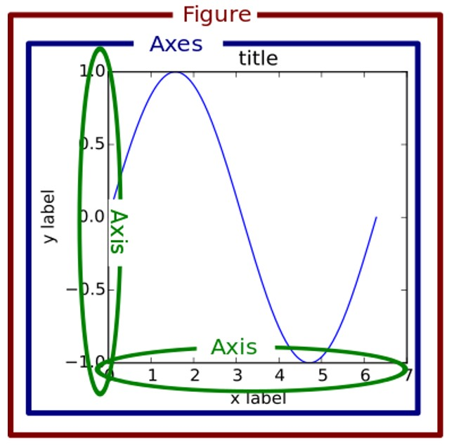
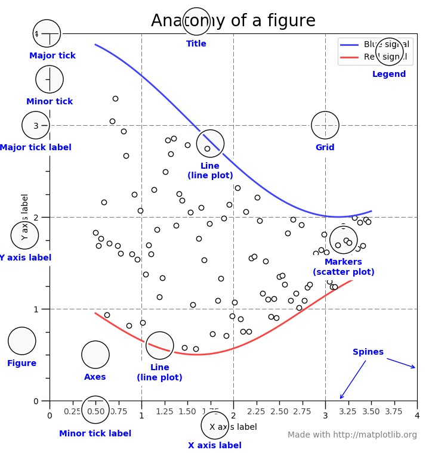

## VISUALIZACIÓN DE DATOS CON PYTHON PARA ANÁLISIS DE COYUNTURA

### Introducción:
* La librería principal para crear gráficos es ```Matplotlib```.
* Es una librería muy extensa, que permite crear una gran variedad de gráficos, permitiendo personalizarlos al máximo (prácticamente todo en el gráfico es modificable).
* Realizar gráficos sencillos requiere una línea de código, pero la tarea se complica al realizar gráficos sofisticados – ¡Todo se puede hacer! Es cuestión de prueba y error y buscar ayuda (ejemplos) online.
* Nos centraremos en el tipo de gráficos más comunes en el análisis de coyuntura económica.
* Existe mucha ayuda online: 
  - https://matplotlib.org/tutorials/index.html
  - https://matplotlib.org/stable/gallery/index.html
  - https://matplotlib.org/stable/tutorials/introductory/sample_plots.html
  - https://realpython.com/python-matplotlib-guide/
  - https://www.python-graph-gallery.com/
* Existen otras librerías disponibles, como [Seaborn](https://seaborn.pydata.org/) o [Plotly](https://plotly.com/python/), pero no tenemos tiempo para verlas. 

* Fundamental en representación gráfica:
  1. Honestidad, 
  2. Inteligibilidad-claridad, 
  3. Elegancia.

* [Ejemplos de gráficos manipulados](https://github.com/otoperalias/teaching/tree/manipulated_graphs)

### Visualización de datos- Pasos:
1. Limpieza y preparación de los datos que queremos representar.
2. Elección del tipo de gráfico y composición.
3. Representación gráfica provisional.
4. Personalización (customization).
5. Mostrar (y guardar) el gráfico.

### Estructura de las figuras en ```matplotlib```:
**Jerarquía de objetos:** 
* Figura > axes (gráficos individuales) > axis (ejes de cada gráfico).


### Anatomía de una figura


### Tipos de gráficos:
Usando la interface de ```pandas```, la cual se basa en la de ```matplotlib```, haciendo su uso más fácil:
* df.plot
* df.plot.area     
* df.plot.barh     
* df.plot.density  
* df.plot.hist    
* df.plot.line     
* df.plot.scatter 
* df.plot.bar      
* df.plot.box      
* df.plot.hexbin   
* df.plot.kde      
* df.plot.pie
Echar in vistazo a la función [```plot()```de ```pandas```](pandas.pydata.org/pandas-docs/version/0.23.4/generated/pandas.DataFrame.plot.html)

### Sintaxis principal:
1. Creamos la figura y los axes (gráficos):  
```python
fig, ax =plt.subplots(nrows=1, ncols=1, *, sharex=False, sharey=False, squeeze=True, subplot_kw=None, gridspec_kw=None, **fig_kw) 
```
2. Añadimos los datos al gráfico (líneas, barras, etc.):  
2.1.  usando la interface de ```pandas```:
```python
df.plot.PLOT_TYPE(x=None, y=None, ax=None, subplots=False, sharex=None, sharey=False, layout=None, figsize=None, use_index=True, title=None, grid=None, legend=True, style=None, logx=False, logy=False, loglog=False, xticks=None, yticks=None, xlim=None, ylim=None, rot=None, fontsize=None, colormap=None, table=False, yerr=None, xerr=None, secondary_y=False, sort_columns=False, **kwargs)
``` 
2.2. O usando la interface de ```matplotlib```:
```python
ax.plot(x, y, **kwargs)
```  
3. Personalizamos el gráfico, por ejemplo, añadimos una nota al pie:
```python
fig.text(x, y, s, fontdict=None, **kwargs)
```
4. Guardamos la figura y la mostramos:
```python
fig.savefig(*args, **kwargs)
```
