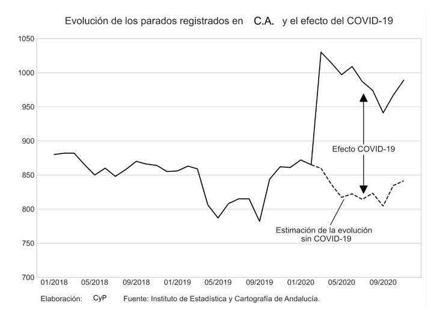

### INSTRUCCIONES PARA LA REALIZACIÓN DEL TRABAJO FINAL

### CURSO 2021-2022

#### *LEA LAS SIGUIENTES INSTRUCIONES CON DETENIMIENTO*
---
* El trabajo consiste en realizar un informe de coyuntura trimestral sobre una de las comunidades autónomas españolas. La comunidad autónoma sobre la que versará el informe es asignada de manera aleatoria por el profesor.
* El trabajo se realizará de grupos de dos, a elegir libremente.
* El informe se supone que va dirigido al equipo de asesores del Consejero de Economía de la Comunidad Autónoma; por tanto, debéis suponer que no va dirigido al profesor. Dadle, pues, un carácter y formato profesional al informe.
* El informe tendrá una extensión máxima equivalente a 15 páginas, donde la calidad primará muy por encima de la cantidad o extensión. Para comprobar si la extensión del informe cumple con el límite de las 15 páginas, pulsar ```Ctrl + P``` 
cuando tengáis abierto el informe en HTML y podréis ver cuántas páginas de PDF se generan.
* La fecha máxima para la entrega del trabajo será el lunes 17 de enero de 2022 a las 23.00 horas. 

#### CONTENIDO DEL INFORME:

**1. Resumen:**
  1. Exponer de manera resumida las principales variables que definen la evolución de la economía de la región.
  2. Explicar y justificar el momento del ciclo en el que se encuentra la economía regional y las previsiones sobre su evolución en el corto plazo.

**2. Actividad productiva:**
  1. Tasas de variación interanual del PIB real (es decir, en volumen). Usar series ajustadas de efectos estacionales y de calendario.
  2. Índice de Producción Industrial. Mostrar la tasa de variación interanual del indicador ajustado por estacionalidad y calendario. Debéis calcular la serie ajustada vosotros mismos.
  3. Índice de confianza empresarial.

**3. Demanda:**
  1. Índice de confianza del consumidor. (El CIS ofrece el dato solo a nivel nacional. Los institutos de estadísticas regionales de algunas CCAA también ofrecen el dato. Si para vuestra CA no se encuentra disponible, mostrar solo el de España).
  2. Mostrar otros indicadores que sirvan para reflejar la situación de la demanda, como indicadores de ventas del sector servicio, etc.
  3. Evolución del sector exterior (exportaciones e importaciones). Calcular tasas de variación anual. Ajustar los datos por estacionalidad y calendario. Si los datos no vienen en términos constantes, hay que deflactar con algún índice de precios. Calcular también el saldo de la balanza comercial y la ratio exportaciones/importaciones.

**4. Mercado de trabajo:**
  1. Tasas de actividad, empleo, paro y temporalidad (EPA). Desagregar por sexo: hombres, mujeres y total.
  2. Evolución de la afiliación a la Seguridad Social. Valores y tasas de variación. Ajustados y sin ajustar por estacionalidad. Debéis realizar vosotros el ajuste.
  3. Evolución del paro registrado. Valores y tasas de variación. Ajustados y sin ajustar por estacionalidad. Debéis realizar vosotros el ajuste.

**5. Precios y costes:**
  1. IPC. Total y el subyacente (sin energía ni alimentos no elaborados). Tasas de variación.
  2. Costes laborales. Salariales y no salariales. Tasas de variación.

**6. Impacto de la crisis y previsiones:**
  1. Mostrar gráficamente el impacto de la crisis sanitaria en la evolución de las afiliaciones a la seguridad social y el paro registrado. La idea es crear gráficos de este tipo (podéis añadir también el intervalo de confianza a la predicción):  
    
  
  2. En base al análisis realizado en el punto anterior, responder a la pregunta de si la economía regional ha vuelto a la senda de evolución pre-covid.  
  3. Aportar una previsión propia de la tasa de paro para el cuarto trimestre de 2020 usando los modelos vistos en clase, en particular, el SARIMAX. Observar que podéis usar los datos de afiliaciones a la Seguridad Social y contratos y paro registrado del mes de diciembre, que se publican a principios de enero, para predecir la tasa de paro de la EPA del cuatro trimestre del 2021. Cuanto más exacta sea vuestra predicción, más nota tendréis en este apartado.
  

**7. Cuadro de indicadores** (Opcional).

---
* Los indicadores arriba citados deben mostrarse en gráficos y, de manera complementaria (en algunos casos que se considere oportuno) en tablas.
* **Mostrar siempre en los gráficos (y tablas, en su caso) los valores para España con fines comparativos.**
* Aunque con frecuencia se indica arriba cómo se deben medir las variables (en tasas de variación interanual, precios constantes, niveles, etc.), no siempre necesariamente se hace. Por tanto, debéis elegir críticamente en cada caso cómo han de ir expresadas o medidas las variables. Por ejemplo, ¿tiene sentido mostrar la tasa de variación del ICC? ¿Tiene sentido mostrar el IPC en niveles?
* Además del uso de gráficos (y, en su caso, tablas), se deberá incluir un breve texto explicativo en cada apartado. En el texto tenéis que describir brevemente la evolución reciente de cada variable , tal y como se hace en los informes de coyuntura referenciados en clase.
* Aunque se trate de un informe de coyuntura trimestral, el estilo del informe debe ser similar a los informes mensuales, es decir, muchos gráficos, algunas tablas y poco texto. Esto es, tienen que ser informes muy “visuales” y atractivos de leer.
* En relación con los periodos a mostrar en el informe, debéis ser consistentes a lo largo del informe y mostrar siempre los mismos. Tomar otros informes como ejemplo para decidir qué rango temporal mostrar.
* El informe se entregará a través del Aula Virtual en formato HTML dentro de un archivo comprimido. Dicho archivo también debe contener el notebook de Jupyter que genera el informe así como un archivo Excel con todos los datos usados en el informe: por tanto, todos los datos recopilados de las fuentes estadísticas y utilizados para realizar el informe deberán estar convenientemente organizados en un fichero Excel donde las diferentes hojas recojan los diferentes conjuntos de datos. El fichero Excel deberá contener también una hoja adicional con una leyenda explicativa.
* [**Aquí**](https://otoperalias.github.io/Coyuntura/) tenéis ejemplos de los mejores informes de los cursos pasados.
---
---

#### **EVALUACIÓN**:
* El trabajo supone seis de los diez puntos que como máximo se pueden obtener en la asignatura. 
* Peso de cada sección del informe:
  1. Resumen: 10%.
  2. Actividad productiva: 20%.
  3. Demanda: 20%.
  4. Mercado de trabajo: 20%.
  5. Precios y costes: 10%.
  6. Impacto de la crisis y previsiones: 20%.

* Cada sección se evaluará tanto por la rigurosidad y pertinencia del contenido como por la forma (es decir, el formato y el estilo). 
* La nota global del informe es igual a la suma ponderada de la puntuación obtenida en cada apartado. Dicha nota sufrirá deducciones en los siguientes casos:  
  * El estilo y formato no se mantienen constantes a lo largo del informe. Por ejemplo, los gráficos del primer apartado son de una manera y los gráficos de otro apartado siguen un formato y estilo diferente. 
  * La estructura es deficiente porque, por ejemplo, no se sigue el orden establecido arriba.  
  * El notebook de Jupyter no genera correctamente el informe. Por ejemplo, no se cargan los datos o los gráficos no se generan.  
  * El fichero Excel con los datos es deficiente (faltan datos) o está muy mal organizado.  

